<div style="text-align: center;">
  
</div>

# WildTrace – Plataforma distribuida para el registro de biodiversidad

## 🌱 Descripción general

**WildTrace** es un sistema distribuido basado en microservicios, diseñado para registrar y visualizar avistamientos de fauna en zonas naturalizadas. Su objetivo es proporcionar una herramienta extensible, modular y preparada para el crecimiento, facilitando la gestión de datos sobre biodiversidad tanto para investigadores como para ciudadanos.

Cada avistamiento queda registrado como una combinación única de especie, zona geográfica y fecha, incluyendo detalles del observador y el método utilizado.

---

## 🧩 Arquitectura del sistema

WildTrace está compuesto por los siguientes microservicios principales:

| Servicio             | Puerto | Descripción                                                    |
|----------------------|--------|----------------------------------------------------------------|
| `discovery-server`   | 8761   | Eureka Server para descubrimiento de servicios                 |
| `gateway-service`    | 8080   | API Gateway, enruta peticiones y redirige por defecto al UI    |
| `species-service`    | 8081   | Gestión del catálogo de especies                               |
| `zone-service`       | 8082   | Gestión de zonas naturalizadas                                 |
| `sighting-service`   | 8083   | Registro de avistamientos de especies                          |
| `frontend-service`   | 8084   | Interfaz web UI (Thymeleaf) para usuarios finales              |

Todos los microservicios están registrados en Eureka y se comunican a través de **Feign Clients**.

### Diagrama inicial de la arquitectura

```
          +------------------------+
          |   discovery-server     | (Eureka)
          +------------------------+
                     ▲
                     |
         +-----------+------------+
         |                        |
+------------------+  +------------------+  +------------------+
|  species-service |  |   zone-service   |  | sighting-service |
+------------------+  +------------------+  +------------------+
         ▲                        ▲                     ▲
         |                        |                     |
         +----------+-------------+---------------------+
                    |
            +------------------+
            |  gateway-service |
            +------------------+  <-- Expuesto en el puerto 8080
```

---

# Diagrama de flujo final

```mermaid
flowchart TB
    %% Nodos principales
    Usuario([Usuario])
    Gateway["gateway-service<br/>(8080)<br/>Swagger UI"]
    Frontend["frontend-service<br/>(8084)<br/>Thymeleaf UI"]
    Species["species-service<br/>(8081)"]
    Zone["zone-service<br/>(8082)"]
    Sighting["sighting-service<br/>(8083)"]
    Discovery["discovery-server<br/>(8761)<br/>Eureka"]

    %% Conexiones
    Usuario -->|Accede a 8080| Gateway
    Gateway -->|Redirección por defecto| Frontend
    Gateway -->|API /api/species/**| Species
    Gateway -->|API /api/zones/**| Zone
    Gateway -->|API /api/sightings/**| Sighting
    Gateway -->|Registro Eureka| Discovery
    Frontend -->|Opcional: Registro Eureka| Discovery
    Species -->|Registro Eureka| Discovery
    Zone -->|Registro Eureka| Discovery
    Sighting -->|Registro Eureka| Discovery
    Frontend -.->|Llamadas REST| Gateway

    %% Agrupaciones visuales
    subgraph Microservicios
        Species
        Zone
        Sighting
    end
```



---

## 1. Descripción General

1. **Usuario**
    - Se conecta al **API Gateway** (`gateway-service`) en el puerto **8080**.

2. **API Gateway (`gateway-service`, puerto 8080)**
    - Redirige por defecto al **Frontend** (`frontend-service`).
    - Realiza llamadas REST a los microservicios:
        - `/api/species/**` → `species-service`
        - `/api/zones/**`   → `zone-service`
        - `/api/sightings/**` → `sighting-service`
    - Se registra en el servidor de descubrimiento (Eureka).

3. **Frontend (`frontend-service`, puerto 8084)**
    - Frontend MVC con Thymeleaf.
    - Opcional: registro/descubrimiento en Eureka para consumir otros servicios.

4. **Microservicios**
    - **species-service** (puerto **8081**)
    - **zone-service**    (puerto **8082**)
    - **sighting-service** (puerto **8083**)
    - Cada uno expone su propia API (ej. `/api/species/**`, `/api/zones/**`, `/api/sightings/**`)
    - Todos se registran en Eureka para ser descubiertos por el Gateway (y el Frontend, si aplica).

5. **Discovery Server (Eureka, puerto 8761)**
    - Punto central de registro/descubrimiento para:
        - `gateway-service`
        - `frontend-service` (opcionalmente)
        - `species-service`
        - `zone-service`
        - `sighting-service`

---

## 📋 Principales funcionalidades

- Registro y consulta de avistamientos de fauna.
- Gestión de especies y zonas naturalizadas.
- Generación y visualización de mapas estáticos mediante integración con Mapbox.
- Interfaz web amigable con Thymeleaf para usuarios finales.
- Arquitectura modular y extensible basada en Spring Boot y Spring Cloud.

---

## 🚀 Instalación y ejecución local

### 1. Clonar el repositorio

```bash
git clone https://github.com/dsuarezg/WildTrace.git
cd WildTrace
```

### 2. Crear las bases de datos en MySQL

```sql
CREATE DATABASE wildtrace_species;
CREATE DATABASE wildtrace_zones;
CREATE DATABASE wildtrace_sightings;
```

### 3. Configurar `application.properties` en cada microservicio

Asegúrate de definir el nombre de la aplicación y la URL de Eureka:

```properties
spring.application.name=species-service
eureka.client.service-url.defaultZone=http://localhost:8761/eureka
```

### 4. Compilar y ejecutar los servicios

En cada subcarpeta correspondiente a un microservicio:

```bash
mvn clean install
mvn spring-boot:run
```

Orden recomendado de arranque:
1. `discovery-server`
2. `gateway-service`
3. `frontend-service`
4. `species-service`
5. `zone-service`
6. `sighting-service`

---

## 🔗 API Gateway y Frontend

- El servicio `gateway-service` escucha en el puerto `8080` y enruta las peticiones a los microservicios.
- Al acceder a `http://localhost:8080/` se redirige automáticamente al frontend (`frontend-service` en 8084).
- La documentación Swagger UI unificada está disponible en:  
  `http://localhost:8080/swagger-ui.html`

---

## 🛠️ Tecnologías utilizadas

- Java 21
- Spring Boot 3.4.6
- Spring Cloud Eureka / OpenFeign / Gateway
- Thymeleaf
- Spring Data JPA
- Swagger / OpenAPI 3
- JUnit 5 / Mockito / MockMvc / TestRestTemplate
- ArchUnit / JaCoCo
- MySQL / MariaDB
- Lombok
- Maven

---

## 🧪 Pruebas y cobertura

Todos los servicios cuentan con:

- Tests unitarios con Mockito
- Tests de integración con MockMvc
- Cobertura con JaCoCo


---

## 📈 Próximos pasos

- [ ] Cachear entidades más consultadas (especies, zonas)
- [ ] Filtros avanzados en Sightings por fecha, especie, zona
- [ ] Enriquecer respuestas con datos relacionados
- [ ] Exponer métricas o estadísticas
- [ ] Refactor hacia arquitectura hexagonal
- [ ] Reutilizar lógica de negocio y hacerla abierta y extensible para usos como incendios, rescates u otro tipo de situaciones de riesgo y catástrofes naturales.

---

## Extra Links

- [Planificación ClickUp](https://sharing.clickup.com/90151157132/g/h/6-901511003926-7/bbb0aa91bd8e20e)
- [Colección de tests en Postman](https://www.postman.com/dsuarezg/wildtrace/collection/rqavbiv/wildtrace-api-collection?action=share&creator=20702470)


---

Desarrollado por Daniel Suárez con ❤️ para **WildTrace**