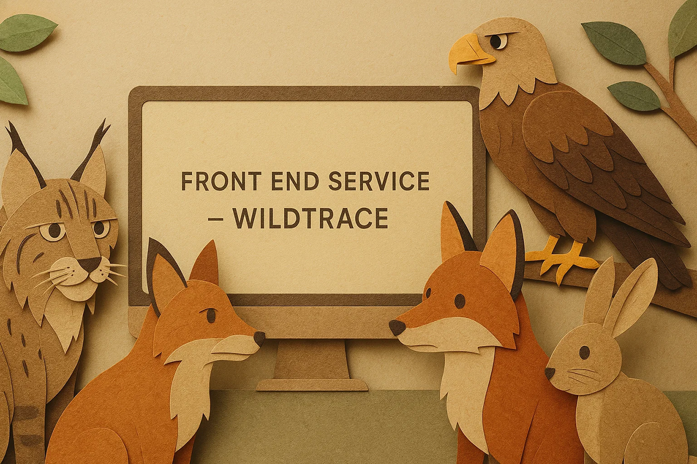

<div align="center">
  
</div>

# WildTrace – Frontend Service

## 🖼️ Descripción del microservicio

Este microservicio proporciona la **interfaz web basada en Thymeleaf** del sistema distribuido **WildTrace**, una plataforma para registrar avistamientos de fauna en zonas naturalizadas.

A través de este portal web, los usuarios pueden visualizar y gestionar:

- 🐾 Catálogo de especies
- 🗺️ Zonas naturalizadas
- 🔭 Avistamientos

El `frontend-service` se comunica con los microservicios backend a través de la **API Gateway** (`gateway-service`).

---

## 🌍 Estructura del frontend

| Sección         | Ruta               | Descripción                                         |
|----------------|--------------------|-----------------------------------------------------|
| Inicio          | `/`                | Página principal con navegación                     |
| Especies        | `/species`         | Listado, creación, edición y borrado de especies    |
| Zonas           | `/zones`           | Gestión de zonas con mapa estático por coordenadas  |
| Avistamientos   | `/sightings`       | Registro y edición de avistamientos con modal de mapa |

---

## 📦 Comunicación con la API

Las llamadas REST se realizan a través del `gateway-service`apuntando a:

```
${wildtrace.gateway.base-url}/api/{species|zones|sightings}
```

> Esta URL base se define en `application.properties`:
```properties
wildtrace.gateway.base-url=http://localhost:8080
```

---

## 🧭 Características destacadas

- UI ligera con **Thymeleaf** + **Tailwind CSS** (importado desde CDN en producción)
- Interactividad con **Alpine.js** (importado desde CDN en producción)
- Select dinámico de especies y zonas en formularios
- Visualización de mapas usando **Mapbox**
- Modal con imagen de satélite para cada avistamiento
- Botones accesibles y coherencia visual, conforme a buenas prácticas en UX/UI.
- Componentes reutilizables y formularios consistentes

---

## ⚙️ Setup local

1. **Clonar el repositorio**
```bash
git clone https://github.com/dsuarezg/WildTrace.git
cd WildTrace/frontend-service
```

2. **Ejecutar el microservicio**
```bash
mvn clean install
mvn spring-boot:run
```

3. **Ver en navegador**
```
http://localhost:8084/
```

> ⚠️ El puerto puede variar si cambias la configuración de `server.port`.

---

## 🖼️ Mapa vía satélite (Mapbox)

Este frontend genera un mapa estático usando [Mapbox Static Images API](https://docs.mapbox.com/api/maps/static-images/) según las coordenadas de cada zona.

### ✅ Requisitos:

1. Define tu token en el backend (`zone-service`) como:

```properties
mapbox.token=pk.your-access-token-here
```

2. El backend incluirá en cada `ZoneResponseDTO` el campo `mapImageUrl` generado dinámicamente con:

```java
String imageUrl = String.format("https://api.mapbox.com/styles/v1/mapbox/satellite-v9/static/pin-s(%f,%f)/%f,%f,14/300x200?access_token=%s", lon, lat, lon, lat, token);
```

3. El frontend mostrará un botón 🗺️ que abre el mapa en un modal (sin recargar página).

---

## 🔧 Tecnologías usadas

- Java 21
- Spring Boot 3.4.6
- Thymeleaf
- Spring MVC 
- Tailwind CSS (CDN, modo producción)
- Alpine.js (CDN, modo producción)
- Mapbox (solo vista)
- HTML + Thymeleaf (sin framework JS tradicional)
- Maven

---

## 📄 Archivos clave

| Archivo                              | Propósito                                  |
|--------------------------------------|---------------------------------------------|
| `HomeController`, `ZoneController`, `SpeciesController`, `SightingController` | Controladores de vistas |
| `templates/**/list.html`, `form.html` | Vistas Thymeleaf                           |
| `banner.png`                         | Imagen principal en index                   |

---

## 🧪 Verificaciones recomendadas

| Página                        | Resultado esperado                         |
|------------------------------|--------------------------------------------|
| `/`                          | Página de inicio con enlaces de navegación |
| `/species`, `/zones`, `/sightings` | Listado y botones funcionales         |
| Modal 🗺️                    | Se abre correctamente con imagen de mapa   |

---

## 🔮 Mejoras futuras

- [ ] Validación de formularios con errores visibles
- [ ] Feedback visual de éxito o error
- [ ] Paginación y búsqueda
- [ ] Migración futura a una SPA con React

> ⚡ Este frontend utiliza **Tailwind CSS** y **Alpine.js** importados directamente desde CDN para estilos e interactividad, en vez de CSS tradicional.
---

Desarrollado con ❤️ como parte del proyecto **WildTrace**