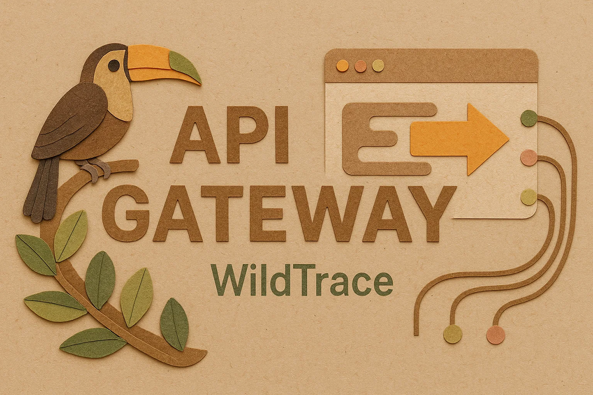

<div style="text-align: center;">
  
</div>

# WildTrace – Gateway Service

## 📦 Descripción del microservicio

Este microservicio actúa como **API Gateway** en el sistema distribuido **WildTrace**, una plataforma basada en microservicios para el registro de avistamientos de fauna en zonas naturalizadas.

`gateway-service` enruta todas las solicitudes entrantes hacia los microservicios específicos:

- `species-service`
- `zone-service`
- `sighting-service`

Además, expone una vista unificada de la documentación **Swagger UI** agregando los endpoints de OpenAPI de los tres servicios.

---

## 🌐 Rutas configuradas

### Enrutamiento con Spring Cloud Gateway

```java
.route("species", r -> r.path("/api/species/**").uri("lb://species-service"))
.route("zone", r -> r.path("/api/zone/**").uri("lb://zone-service"))
.route("sighting", r -> r.path("/api/sighting/**").uri("lb://sighting-service"))
.route("default-fallback", r -> r.alwaysTrue().uri("lb://fallback-service"))

---

## 📄 Swagger UI agregado

La documentación de la API está disponible en:

```
http://localhost:8080/swagger-ui.html
```

Desde esta vista puedes ver los endpoints de los 3 microservicios.

### Configuración en `application.properties`

```properties
spring.application.name=gateway-service
server.port=8080
spring.main.web-application-type=reactive

# Eureka Client
eureka.client.service-url.defaultZone=http://localhost:8761/eureka/
eureka.instance.hostname=localhost

# Swagger/OpenAPI agregado manualmente
springdoc.api-docs.enabled=true
springdoc.api-docs.path=/v3/api-docs
springdoc.swagger-ui.path=/swagger-ui.html

# Rutas Swagger individuales por microservicio
springdoc.swagger-ui.urls[0].name=species
springdoc.swagger-ui.urls[0].url=http://localhost:8081/v3/api-docs
springdoc.swagger-ui.urls[1].name=zone
springdoc.swagger-ui.urls[1].url=http://localhost:8082/v3/api-docs
springdoc.swagger-ui.urls[2].name=sighting
springdoc.swagger-ui.urls[2].url=http://localhost:8083/v3/api-docs
```

---

## ⚙️ Setup local

1. **Clonar el repositorio**
```bash
git clone https://github.com/dsuarezg/WildTrace.git
cd WildTrace/gateway-service
```

2. **Ejecutar el microservicio**
```bash
mvn clean install
mvn spring-boot:run
```

3. **Verificar el registro en Eureka**
```
http://localhost:8761/
```

4. **Acceder a Swagger UI**
```
http://localhost:8080/swagger-ui.html
```

---

## 🔧 Tecnologías usadas

- Java 21
- Spring Boot 3.4.6
- Spring Cloud Gateway
- Eureka Client (Service Discovery)
- SpringDoc OpenAPI (con `springdoc-openapi-starter-webflux`)
- Maven

---

## 🛡️ CORS y seguridad

Los microservicios deben tener configurado CORS si van a ser consultados a través del Gateway:

```java
@Bean
public WebMvcConfigurer corsConfigurer() {
    return new WebMvcConfigurer() {
        @Override
        public void addCorsMappings(CorsRegistry registry) {
            registry.addMapping("/**")
                    .allowedOrigins("*")
                    .allowedMethods("*");
        }
    };
}
```

---

## 🧪 Verificaciones

| URL                           | Resultado esperado                |
|------------------------------|-----------------------------------|
| `http://localhost:8080/swagger-ui.html` | Swagger UI unificado        |
| `http://localhost:8761/`     | Todos los microservicios registrados |
| `http://localhost:8080/api/species` | Redirige al species-service |

---

## 🔮 Mejoras futuras

- [ ] Añadir filtros globales para logging o autenticación JWT
- [ ] Agregar soporte de rate-limiting por usuario
- [ ] Unificar Swagger vía agregación automática en lugar de estática
- [ ] Añadir control de errores personalizados a nivel de Gateway

---

Desarrollado con ❤️ para **WildTrace**