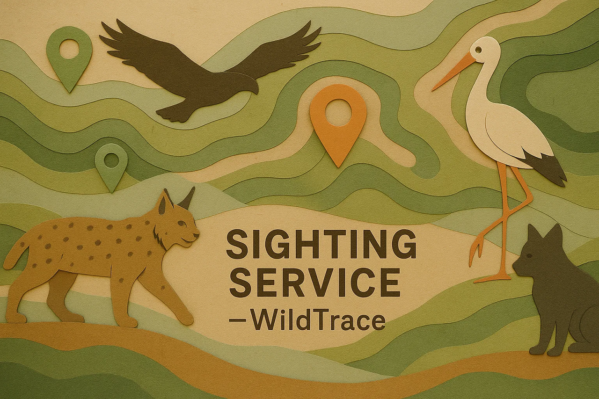

<div style="text-align: center;">
  
</div>

# WildTrace – Sighting Service

## Descripción del microservicio

Este microservicio forma parte del ecosistema **WildTrace**, una aplicación distribuida para registrar y consultar avistamientos de fauna en zonas naturalizadas.

`sighting-service` permite registrar cuándo, dónde y por quién se observó una especie. Cada avistamiento requiere que la especie y la zona existan previamente (validadas vía Feign con `species-service` y `zone-service`).

El servicio ofrece:
- Registro y eliminación de avistamientos
- Validación cruzada con otros microservicios
- Exposición de datos con Swagger/OpenAPI
- Tests de unidad, integración y funcionales

---

### Entidad principal: `Sighting`

```text
Sighting
 ├── Long id
 ├── Long zoneId
 ├── Long speciesId
 ├── LocalDate date
 ├── String observedBy
 ├── String method
 ├── String notes
```

Se utilizan los siguientes DTOs:

```text
SightingRequestDTO
 ├── Long zoneId
 ├── Long speciesId
 ├── LocalDate date
 ├── String observedBy
 ├── String method
 ├── String notes

SightingResponseDTO
 ├── Long id
 ├── Long zoneId
 ├── Long speciesId
 ├── LocalDate date
 ├── String observedBy
 ├── String method
 ├── String notes
```

---

## Setup local (instalación)

1. **Clonar el repositorio:**
```bash
git clone https://github.com/dsuarezg/WildTrace.git
cd WildTrace/sighting-service
```

2. **Crear base de datos (opcional, si usas persistencia real):**
```sql
CREATE DATABASE wildtrace_sightings;
```

3. **Configurar `application.properties`:**
```properties
spring.application.name=sighting-service

spring.datasource.url=jdbc:mysql://localhost:3306/wildtrace_sightings
spring.datasource.username=username
spring.datasource.password=password
spring.datasource.driver-class-name=com.mysql.cj.jdbc.Driver

spring.jpa.hibernate.ddl-auto=update
spring.jpa.show-sql=true
server.port=8083

# Feign & Eureka
eureka.client.service-url.defaultZone=http://localhost:8761/eureka
spring.cloud.openfeign.client.config.default.connectTimeout=3000
spring.cloud.openfeign.client.config.default.readTimeout=3000
```

4. **Ejecutar Eureka y los microservicios dependientes:**
    - `discovery-service`
    - `species-service`
    - `zone-service`

5. **Levantar este microservicio:**
```bash
mvn clean install
mvn spring-boot:run
```

6. **Acceder a la documentación Swagger:**
```
http://localhost:8083/swagger-ui/index.html
```

---

## Tecnologías utilizadas

- Java 21
- Spring Boot 3.4.6
- Spring Data JPA
- Spring Cloud OpenFeign
- Eureka Discovery Client
- Swagger / OpenAPI 3
- JUnit 5 / Mockito / MockMvc
- ArchUnit
- JaCoCo
- Lombok

---

## Validaciones y arquitectura

- Verificación de existencia de especie y zona vía Feign (`species-service`, `zone-service`)
- Excepciones personalizadas (`SpeciesNotFoundException`, `ZoneNotFoundException`, `SightingNotFoundException`)
- DTOs validados con `@Valid`
- Arquitectura en capas validada con ArchUnit
- Preparado para refactor a arquitectura hexagonal (futuro)

---

## Cobertura de tests (JaCoCo)

```bash
mvn clean verify
```

Informe generado en:
```
sighting-service/target/site/jacoco/index.html
```

Incluye:
- Tests unitarios (`SightingService`)
- Tests de integración (`SightingControllerTest`)
- Tests funcionales con `TestRestTemplate`

---

## Endpoints REST principales

| Método | Endpoint                | Descripción                           |
|--------|-------------------------|---------------------------------------|
| GET    | `/api/sightings`        | Listar todos los avistamientos        |
| GET    | `/api/sightings/{id}`   | Consultar avistamiento por ID         |
| POST   | `/api/sightings`        | Registrar un nuevo avistamiento       |
| DELETE | `/api/sightings/{id}`   | Eliminar un avistamiento por su ID    |

---

## Buenas prácticas aplicadas

- Separación de responsabilidades (`Controller`, `Service`, `Repository`, `Mapper`)
- Validación cruzada con microservicios mediante Feign
- Tests **FIRST**: rápidos, independientes, auto-validables y oportunos
- Manejo robusto de errores con `@ExceptionHandler`
- Mapeo limpio entre entidades y DTOs

---

## Mejoras futuras

- [ ] Añadir filtros por fecha, especie o zona en `/api/sightings`
- [ ] Añadir paginación y ordenación
- [ ] Enriquecer la respuesta con info extendida (especie/zona en lugar de solo ID)
- [ ] Implementar caché para validaciones de especie/zona
- [ ] Exponer estadísticas básicas: especies más vistas, zonas con más avistamientos

---

Desarrollado con ❤️ para **WildTrace**